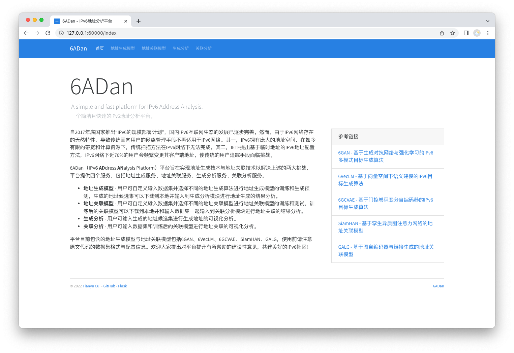
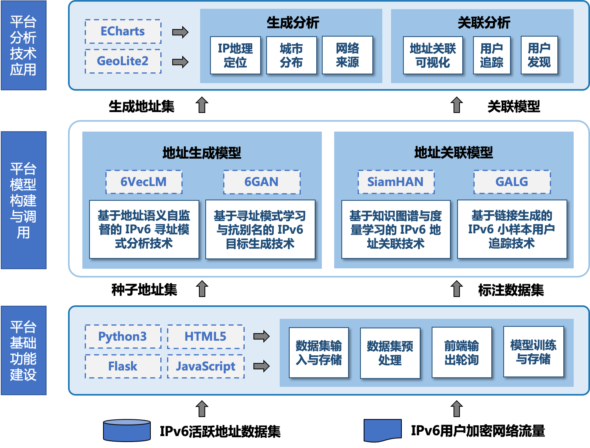
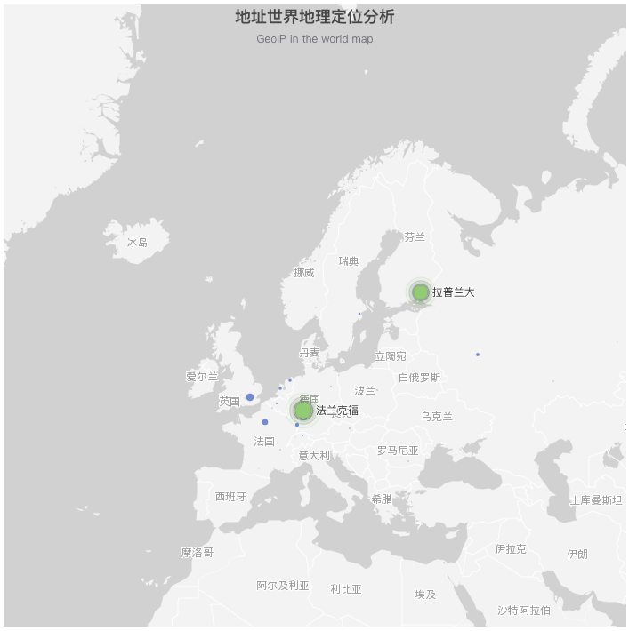
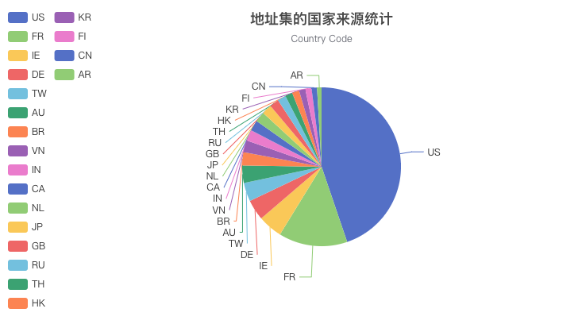
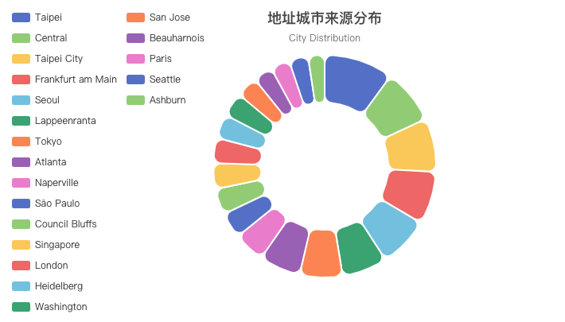
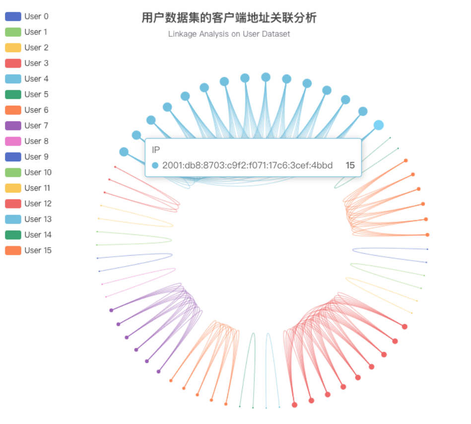
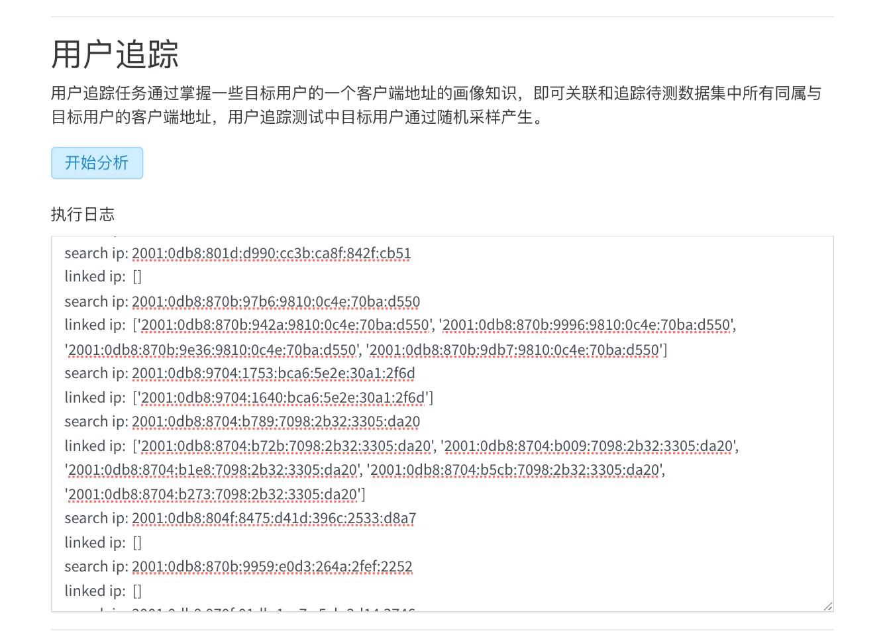
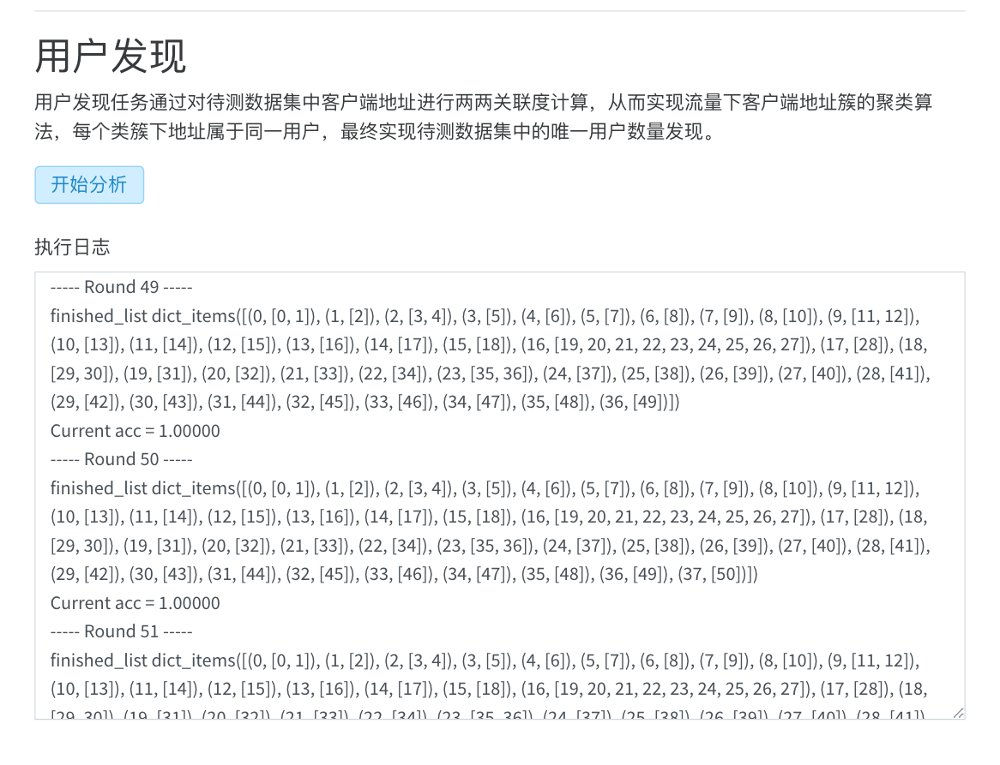

# 6ADan

**基于地址探测与关联技术的IPv6地址分析平台**



自2017年底国家推出“IPv6的规模部署计划”，国内IPv6互联网生态的发展已逐步完善。然而，由于IPv6网络存在的天然特性，导致传统面向用户的网络管理手段不再适用于IPv6网络。其一，IPv6拥有庞大的地址空间，在如今有限的带宽和计算资源下，传统扫描方法在IPv6网络下无法完成。其二，IETF提出基于临时地址的IPv6地址配置方法，IPv6网络下近70%的用户会频繁变更其客户端地址，使传统的用户追踪手段面临挑战。

6ADan（IPv**6** **AD**dress **AN**alysis Platform）平台旨在实现地址生成技术与地址关联技术以解决上述的两大挑战，平台提供四个服务，包括地址生成服务、地址关联服务、生成分析服务、关联分析服务。

* **地址生成模型**：用户可自定义输入数据集并选择不同的地址生成算法进行地址生成模型的训练和生成预测，生成的地址候选集可以下载到本地并输入到生成分析模块进行地址生成的结果分析。

* **地址关联模型**：用户可自定义输入数据集并选择不同的地址关联模型进行地址关联模型的训练和测试，训练后的关联模型可以下载到本地并和输入数据集一起输入到关联分析模块进行地址关联的结果分析。
* **生成分析**：用户可输入生成的地址候选集进行生成地址的可视化分析。
* **关联分析**：用户可输入数据集和训练后的关联模型进行地址关联的可视化分析。

平台目前包含的地址生成模型与地址关联模型包括6GAN、6VecLM、6GCVAE、SiamHAN、GALG，使用前请注意原文代码的数据集格式与配置信息。欢迎大家提出对平台提升有所帮助的建设性意见，共建美好的IPv6社区！

## 环境依赖

* Python 3
* [Flask 2.2.x](https://flask.palletsprojects.com/en/2.2.x/)
* [GeoIP2](https://pypi.org/project/geoip2/)
* [TensorFlow](https://www.tensorflow.org/install/) (>1.0)
* [gensim](https://radimrehurek.com/gensim/models/word2vec.html)
* [scikit-learn](http://scikit-learn.org/stable/)
* [ipaddress](https://docs.python.org/3/library/ipaddress.html#module-ipaddress)
* [ipv6toolkit](https://github.com/fgont/ipv6toolkit) (6GAN基于**RFC Based**的种子分类方法)
* [entropy-clustering](https://github.com/pforemski/entropy-clustering) (6GAN基于**Entropy Clustering**的种子分类方法)
* [PyTorch 1.3.1](https://pytorch.org/)
* [Keras](https://keras.io/) (2.2.4)
* [networkx](https://networkx.github.io/)
* [scipy](https://www.scipy.org/_)

## 平台运行

```python
python app.py
```

平台的Web程序将运行在设备的``60000``端口，访问``http://127.0.0.1:60000/index``将进入IPv6地址分析平台的首页部分。

## 平台架构

IPv6地址分析平台6ADan是基于``Python Flask``实现的``Web``应用程序框架，主要可以分为三个处理单元，包括平台基础功能建设、平台模型构建与调用、平台分析技术应用。具体框架如下：



* **平台基础功能建设**：平台基础功能建设部分的主要目标是实现平台的基 本框架、功能和数据基础支撑
* **平台模型构建与调用**：平台模型构建与调用部分主要实现了本文实现的 地址生成模型和地址关联模型的模型训练与调用过程
* **平台分析技术应用**：平台分析技术应用部分基于可视化技术完成对地址生 成结果和地址关联结果的分析工作。

## 地址生成模型

6ADan可以选择``地址生成模型``进行模型训练，平台目前包括的目标生成算法如下，可选择其中任意一种完成输入数据集下的地址生成模型构建。

* **6GAN** - 基于生成对抗网络与强化学习的IPv6多模式目标生成算法
* **6VecLM** - 基于向量空间下语义建模的IPv6目标生成算法
* **6GCVAE** - 基于门控卷积变分自编码器的IPv6目标生成算法

## 地址关联模型

6ADan可以选择``地址关联模型``进行模型训练，平台目前包括的地址关联模型如下，可选择其中任意一种完成输入数据集下的地址关联模型构建。

- **SiamHAN** - 基于孪生异质图注意力网络的地址关联模型
- **GALG** - 基于图自编码器与链接生成的地址关联模型

## 生成分析

完成地址生成任务后，研究人员可输入生成的地址候选集进行生成地址的可视化分析。对于地址生成任务，6ADan将基于 Echarts 和 GeoLite2 库完成对生成的地址集的 IP 地理定位、城市分布、网络来源等可视化分析工作。

### IP地理定位分析



### 国家来源分析



### 城市分布分析



## 关联分析

完成地址关联任务后，研究人员可输入待测数据集进行关联分析任务。对于地址关联任务，关联分析模块将基于 Echarts 对关联的地址进行可视化展示，并基于 输入的待测数据集和训练后的关联模型进行用户追踪和用户发现的实际任务。

### 地址关联可视化



### 用户追踪



### 用户发现



## 参考链接

6GAN: https://github.com/CuiTianyu961030/6GAN

6VecLM: https://github.com/CuiTianyu961030/6VecLM

6GCVAE: https://github.com/CuiTianyu961030/6GCVAE

SiamHAN: https://github.com/CuiTianyu961030/SiamHAN

GALG: https://github.com/CuiTianyu961030/GALG