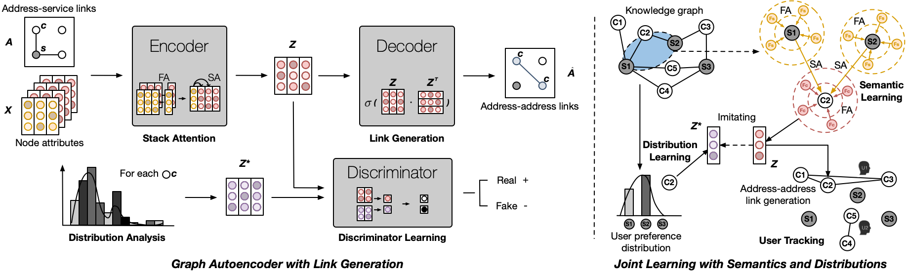

# GALG

**The repository of GALG, a graph-based artificial intelligence approach to link addresses for user tracking on TLS encrypted traffic.**

GALG uses the framework of Graph Auto-encoder and adversarial training to learn the user embedding with semantics and distributions. Employing a new theory – **link generation**, GALG could link all the addresses of target users from the knowledge of address-service links.



The work is introduced in the European Conference on Machine Learning and Principles and Practice of Knowledge Discovery in Databases (ECML/PKDD 2022):

> Tianyu Cui, Gang Xiong, Chang Liu, Junzheng Shi, Peipei Fu, Gaopeng Gou. GALG: Linking Addresses in Tracking Ecosystem Using Graph Autoencoder with Link Generation. European Conference on Practice of Knowledge Discovery in Databases 2022.

Note: this code is based on [GAE](https://github.com/tkipf/gae), [ARGA](https://github.com/GRAND-Lab/ARGA), [GAT](https://github.com/PetarV-/GAT), and [Link Prediction Experiments](https://github.com/lucashu1/link-prediction). Many thanks to the authors.

## Requirements

* python 3
* [TensorFlow](https://www.tensorflow.org/install/) (1.0 or later)
* [gensim](https://radimrehurek.com/gensim/install.html)
* [networkx](https://networkx.github.io/)
* [scikit-learn](http://scikit-learn.org/stable/)
* [scipy](https://www.scipy.org/_)

## Run

```python main.py
python main.py
```

## Data

For privacy consideration, here we only provide the public dataset we used in the paper.

* `CSTNET`: [CSTNET](https://github.com/CuiTianyu961030/SiamHAN) is a public dataset collected from March to July 2018 on China Science and Technology Network (CSTNET). 

If you want to use your own data, please check if the data format is the same as `data/cstnet.json` and specify the data path in `main.py`.

## Models

You can choose between the following models:

* `GALG`: Graph Auto-Encoder for Link Generation
* `VGALG`: Variational Graph Auto-Encoder for Link Generation

## Utils

We provide the utils for extensive experiments on the task of user tracking and link generation:

* `baselines`: All link prediction methods modified with the link generation framework.

The link prediction methods include:

* [(Variational) Graph Auto-Encoders](https://arxiv.org/abs/1611.07308): An end-to-end trainable convolutional neural network model for unsupervised learning on graphs
* [Adversarially Regularized (Variational) Graph Autoencoder](https://www.ijcai.org/proceedings/2018/0362.pdf): An adversarial graph embedding framework for robust graph embedding learning
* [Node2Vec/DeepWalk](http://snap.stanford.edu/node2vec/): A skip-gram based approach to learning node embeddings from random walks within a given graph
* [Spectral Clustering](http://scikit-learn.org/stable/modules/generated/sklearn.manifold.SpectralEmbedding.html): Using spectral embeddings to create node representations from an adjacency matrix
* [Heuristics](https://networkx.org/documentation/networkx-1.10/reference/algorithms.link_prediction.html): Common Neighbors, Jaccard, and Preferential Attachment

